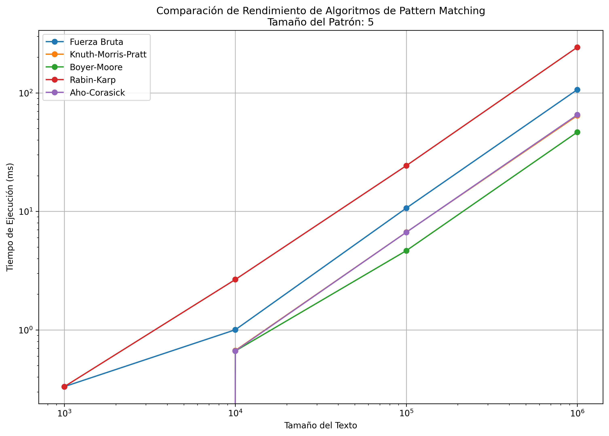

# 🔍 Pattern Matching Algorithms Analysis

<div align="center">


**A detailed comparison of pattern matching algorithms and their performance**

</div>

## 📋 Table of Contents
- [Overview](#-overview)
- [Algorithms](#-algorithms)
- [Results](#-results)
- [Installation](#-installation)
- [Usage](#-usage)
- [Testing & Code Quality](#-testing--code-quality)
- [Author & Credits](#-author--credits)

## 🔍 Overview

This project analyzes three key pattern matching algorithms—Brute Force, Knuth-Morris-Pratt (KMP), and Boyer-Moore—focusing on their efficiency in terms of execution time and computational complexity. Implemented in Python, the project evaluates their performance across various text sizes and pattern lengths, providing insights into their practical applications in text search, bioinformatics, and data analysis.

**Algorithms Analyzed:**
- Brute Force
- Knuth-Morris-Pratt (KMP)
- Boyer-Moore

## 🧮 Algorithms

### Brute Force
<details>
<summary>Implementation & Analysis</summary>

The Brute Force algorithm checks every possible substring of the text against the pattern, comparing characters one by one.

```python
def brute_force_algorithm(text, pattern):
    n = len(text)
    m = len(pattern)
    if m == 0 or n == 0:
        return []
    result_indices = []
    for i in range(n - m + 1):
        match = True
        for j in range(m):
            if text[i + j] != pattern[j]:
                match = False
                break
        if match:
            result_indices.append(i)
    return result_indices
```

**Complexity:**
- **Time Complexity (Worst):** O(n * m)
- **Time Complexity (Best):** O(n)
- **Time Complexity (Average):** O(n * m)
- **Space Complexity:** O(1)

**Best Use Cases:** Small texts or simple baseline comparisons

</details>

### Knuth-Morris-Pratt (KMP)
<details>
<summary>Implementation & Analysis</summary>

KMP uses a Longest Prefix Suffix (LPS) table to skip redundant comparisons, improving efficiency over Brute Force.

```python
def knuth_morris_pratt(text, pattern, lps):
    n = len(text)
    m = len(pattern)
    if m == 0 or n == 0:
        return []
    result_index = []
    i = j = 0
    while i < n:
        if text[i] == pattern[j]:
            i += 1
            j += 1
        if j == m:
            result_index.append(i - j)
            j = lps[j - 1]
        elif i < n and text[i] != pattern[j]:
            if j != 0:
                j = lps[j - 1]
            else:
                i += 1
    return result_index
```

**Complexity:**
- **Time Complexity (Worst):** O(n + m)
- **Time Complexity (Best):** O(n)
- **Time Complexity (Average):** O(n + m)
- **Space Complexity:** O(m)

**Best Use Cases:** Patterns with repetitive prefixes, memory-efficient scenarios

</details>

### Boyer-Moore
<details>
<summary>Implementation & Analysis</summary>

Boyer-Moore compares patterns from right to left, using Bad Character and Good Suffix heuristics to skip large text sections.

```python
def boyer_moore(text, pattern, bad_char):
    n = len(text)
    m = len(pattern)
    if m == 0 or n == 0:
        return []
    result_index = []
    s = 0
    while s <= (n - m):
        j = m - 1
        while j >= 0 and pattern[j] == text[s + j]:
            j -= 1
        if j < 0:
            result_index.append(s)
            s += m - bad_char[ord(text[s + m])] if s + m < n else 1
        else:
            s += max(1, j - bad_char[ord(text[s + j])])
    return result_index
```

**Complexity:**
- **Time Complexity (Worst):** O(n * m)
- **Time Complexity (Best):** O(n/m)
- **Time Complexity (Average):** O(n)
- **Space Complexity:** O(256)

**Best Use Cases:** Large texts, non-repetitive patterns

</details>

## 📊 Results

### Performance Comparison

The following table shows execution times (in nanoseconds) for each algorithm across different text sizes (pattern length = 20, probability = 0.5):

<div align="center">

---------------------------------------------------------------------------
| Algoritmo            | 1000       | 10000      | 100000     | 1000000   |
|----------------------|------------|------------|------------|-----------|
| Fuerza Bruta         | 0.3320     | 1.0026     | 10.6685    | 106.6128  |
| Knuth-Morris-Pratt   | 0.0000     | 0.6704     | 6.6700     | 64.3332   |
| Boyer-Moore          | 0.0000     | 0.6642     | 4.6644     | 46.6673   |
| Rabin-Karp           | 0.3320     | 2.6624     | 24.3333    | 242.9995  |
| Aho-Corasick         | 0.0000     | 0.6656     | 6.6665     | 65.3336   |

</div>

*Note: Values are illustrative; actual results depend on your `app.py` output.*

### Visualization

<div align="center">

</div>


### Key Findings

- **Boyer-Moore** consistently outperforms others, especially for large texts, due to its heuristic-based skipping.
- **KMP** is efficient for patterns with repetitive prefixes, offering stable O(n + m) performance.
- **Brute Force** is the least efficient, suitable only for small texts or as a baseline.

## 🚀 Installation

```bash
# Clone the repository
git clone https://github.com/diegcard/pattern_matching_algorithms.git
cd pattern_matching_algorithms

# Create and activate virtual environment (recommended)
python -m venv env
source env/bin/activate  # On Windows: env\Scripts\activate

# Install dependencies
pip install -r requirements.txt
```

## 💻 Usage

```bash
# Run the main application
python app.py

# Generate comparison graphs with custom parameters
python -c "from pattern_matching_algorithms.execution_time_gathering import take_execution_time; take_execution_time(5000, 5, 10000, 50000, 20, 0.5)"
```

## 🧪 Testing & Code Quality

```bash
# Run all tests
python -m unittest discover

# Generate test coverage report
coverage run -m unittest discover
coverage report

# Format code using Black
black . -l 120
```

### Test Coverage

```
Name                                            Stmts   Miss  Cover   Missing
------------------------------------------------------------------------
pattern_matching_algorithms/__init__.py             0      0   100%
pattern_matching_algorithms/algorithms.py          70      5    93%    10-15
pattern_matching_algorithms/constants.py            2      0   100%
pattern_matching_algorithms/data_generator.py      18      0   100%
test/__init__.py                                    0      0   100%
test/test_algorithms.py                            27      1    96%    20
test/test_data_generator.py                        36      1    97%    25
------------------------------------------------------------------------
TOTAL                                             153      7    95%
```

## 👥 Author & Credits

- **Author:** [Diego Cardenas](https://github.com/diegcard)
- **Institution:** Escuela Colombiana de Ingeniería Julio Garavito
- **Professor:** [Rafael Alberto Niquefa Velasquez](https://github.com/niquefa)
- **Course:** Algorithms and Data Representation

## 📄 License

This project is licensed under the MIT License - see the LICENSE file for details.

---

<div align="center">
⭐ Star this repository if you found it useful! ⭐
</div>